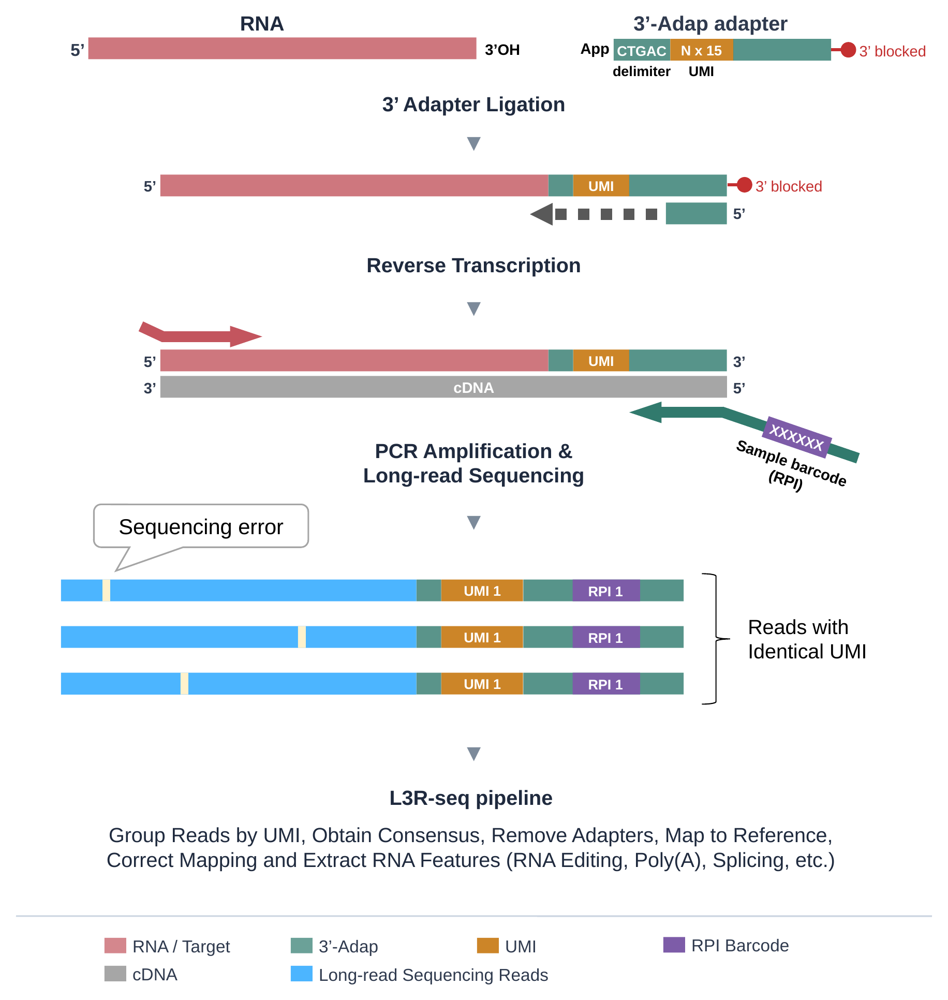
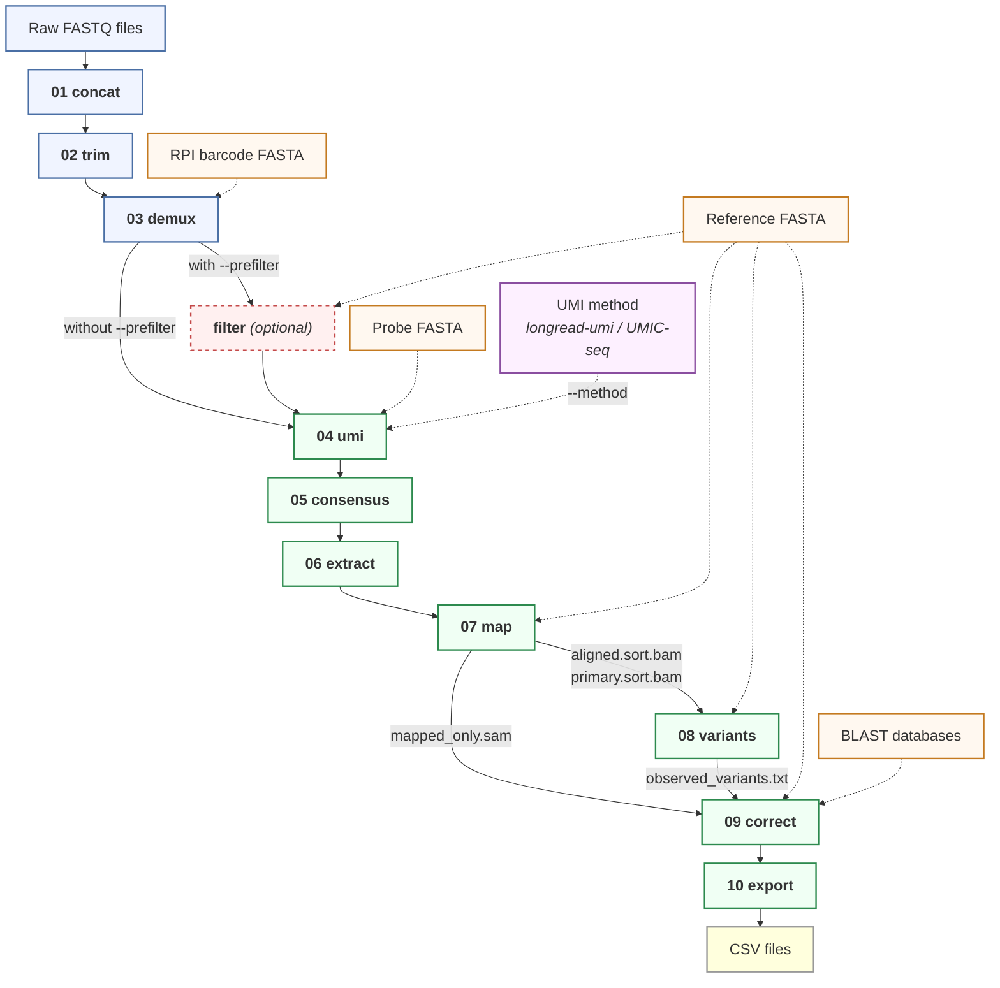

**README** | [Adaptation](docs/adaptation.md) | [Requirements](docs/requirements.md) | [Code Overview](docs/code-overview.md) | [Development](docs/development.md)

📖 **Full documentation site:** https://akihitomamiya-del.github.io/L3R-seq/

---

# L3Rseq

This is the accompanying bioinformatics pipeline for **[L3R-seq](#citation)** (Long-read 3' RACE-seq), a targeted long-read sequencing method for deep quantitative analysis of RNA processing. L3R-seq ligates a UMI-containing adapter ([Scheer et al. 2020](https://doi.org/10.1007/978-1-4939-9822-7_8)) to the 3' end of RNA, then uses Oxford Nanopore sequencing to read full-length cDNA amplicons. Starting from raw reads, the pipeline groups them by unique molecular identifier (UMI) and builds a consensus sequence for each original RNA molecule, correcting random sequencing errors and mitigating PCR-duplicate-driven quantification biases. Each consensus read is then mapped, corrected, and annotated to produce per-molecule tables of RNA editing, 3' end cleavage, polyadenylation, and splicing. Results can be explored in a built-in browser-based alignment viewer.



## How to start

**Option A: GitHub Codespaces (no installation)**

Runs entirely in the cloud from this repository's GitHub page — no local installation or hardware requirements. Ideal for getting started quickly or if your machine does not meet the [hardware requirements](docs/requirements.md). Click **Code** > **Codespaces** > **...** > **New with options** on this page. On the options page, select:

- **Branch** — `main`
- **Dev container configuration** — choose one (see table below)
- **Machine type** — 4-core or higher recommended for pipeline runs (the default 2-core will be slow)

Clicking **Create codespace** directly (without "New with options") uses the default configuration (L3Rseq Pipeline) with a 2-core machine. Use **New with options** to select a faster machine type.

> **L3Rseq Pipeline** (default)
> Run the pipeline and explore results. Uses a pre-built image — fastest to start.

> **L3Rseq Pipeline (Claude Code Sandbox)**
> AI-assisted analysis and development with [Claude Code](docs/development.md#claude-code-ai-assisted-development). Useful if you are less familiar with command-line tools — Claude can run the pipeline, explain results, and help you adapt the code. Also useful for development: Claude can edit, test, commit, and push changes. Based on Anthropic's [official Claude Code DevContainer](https://github.com/anthropics/claude-code/tree/main/.devcontainer), with a network firewall for safe autonomous use.

> **L3Rseq Pipeline (build)**
> Build the Docker image from source for development and testing local changes to the Dockerfile or conda environments.

**Option B: Docker (local data)**
```bash
docker pull ghcr.io/akihitomamiya-del/l3rseq:latest
```
See [Docker usage details](#docker-usage) below for interactive mode, docker compose, and data mount explanation.

**Option C: VS Code devcontainer (local)**
Clone the repo, open in VS Code, and select **Reopen in Container**, then choose a configuration (see table above).

## Running the pipeline

**What you need:**

| Input | Description |
|---|---|
| Demultiplexed FASTQs | Basecalled (SUP model) and native-barcode-demultiplexed by dorado |
| Reference FASTA | Genomic (DNA) sequence of your target gene + downstream region |
| Sample barcode FASTA | One entry per RPI (sample-specific index primer, 20 nt) |

To verify the installation with synthetic test data:

```bash
bash tests/run_tests.sh --quick     # smoke test (~30s)
L3Rseq viewer                       # open the viewer (check Ports tab for URL)
```

### Recommended: Snakemake

The recommended way to run the pipeline is via [Snakemake](https://snakemake.readthedocs.io/), which gives DAG parallelism across `{barcode, RPI}` samples (different stages run concurrently for different RPIs), resume-from-failure on interrupt, and per-rule resource isolation.

```bash
conda activate l3rseq_py
snakemake --cores 8 --configfile config.yaml
```

The bare command above runs the pipeline on the bundled test fixtures (a quick way to verify the install works end-to-end via Snakemake). For your own data, copy and edit [`examples/run_with_snakemake.sh`](examples/run_with_snakemake.sh) — it points Snakemake at your input/output paths and reference via `--config key=val` overrides, dry-runs the DAG first, then executes.

`config.yaml` is the single source of truth — every step parameter (input/output dirs, reference, RPI fasta, UMI method, thresholds) lives there. Override at the command line with `--config key=value`. See [`config.yaml`](config.yaml) in the repo root for the full schema with comments, and [Development](docs/development.md#running-the-pipeline-with-snakemake) for per-experiment YAMLs.

Outputs land in `<output_dir>/01_concat/` through `<output_dir>/10_csv/`. Gene-level counting (step 11) is an optional [post-analysis](#post-analysis) step invoked separately. Snakemake automatically resumes if interrupted — the same command picks up where it left off.

### Alternative: Bash dispatcher

For quick one-off runs without editing a YAML, the bash dispatcher accepts CLI flags directly:

```bash
L3Rseq run --input data/ --outdir results/ --ref ref.fa \
    --rpi-fasta barcodes.fa --pattern CT --threads 8
```

This runs the core pipeline (steps 01–10). Use `--start-at` and `--stop-at` to run a subset of steps (e.g. `--start-at 4` skips preprocessing for pre-demultiplexed data). Each step is also available as a standalone subcommand (e.g. `L3Rseq map --input <dir> --outdir <dir> --ref <ref.fa>`); see the [code overview](docs/code-overview.md) for per-step usage. If you prefer AI-assisted analysis, see [Claude Code](docs/development.md#claude-code-ai-assisted-development).

**Common options for `L3Rseq run`:**

```bash
--start-at 4              # skip preprocessing (steps 01-03)
--stop-at 7               # stop after mapping
--pattern CT,AG           # dual editing patterns
--count-pattern TC        # SLAM-seq T-to-C counting
--introns "847-2891"      # classify reads as spliced/unspliced
--prefilter               # rough-map pre-filter for noisy libraries
--method umic-seq --probe probe.fa   # alternative UMI method
--umi-parallel-jobs 8     # run 8 RPIs concurrently in step 04 (default: 1 = serial)
```

**Performance notes.** Both paths produce the same outputs.

- **Snakemake** wins on larger jobs — DAG parallelism runs different stages concurrently for different RPIs. Has per-rule overhead (~1-2s per rule for conda activation + tmp staging) which can dominate on very small datasets (<20 RPIs, fast amplicon refs). On amplicon-scale data with few samples, the bash dispatcher with `--umi-parallel-jobs N` may finish in less wall time. On genome-wide refs or 30+ RPIs, snakemake's DAG parallelism dominates.
- **Bash dispatcher** `--umi-parallel-jobs N` only parallelizes step 04. Stages 05-10 still iterate RPIs serially within each step (though tools like racon/minimap2 use multiple threads internally).
- The devcontainer also mounts a fast `/runs` Docker volume at `/workspace/runs` so pipeline outputs avoid the slow Windows-host bind on WSL2. Combining ext4 + RPI parallelism gave ~30× end-to-end speedup vs the 9P baseline on LibCheck. Details in [docs/pipeline_speed_investigation.md](docs/pipeline_speed_investigation.md).

To override per-step defaults from a YAML file when using the bash dispatcher, pass the global `--config-file` flag before the subcommand: `L3Rseq --config-file my.yaml run ...`.

## Pipeline overview



```
01 concat     Concatenate per-barcode FASTQ files
02 trim       3-pass adapter trimming (cutadapt)
03 demux      RPI barcode demultiplexing (cutadapt)
   filter     Optional: retain only on-target reads by rough mapping
04 umi        UMI extraction and read grouping
05 consensus  Racon-based consensus calling
06 extract    Target region extraction (cutadapt)
07 map        Mapping to reference (minimap2)
08 variants   Variant calling (LoFreq)
09 correct    3' tail correction with CIGAR-walk (Python / pysam)
10 export     CSV export + quality report

(optional post-analysis)
11 count      Gene-level molecule counting (Python / pysam)
```

For per-file details (inputs, outputs, tools, line counts), see the [Code Overview](docs/code-overview.md).

### Post-analysis

After the main pipeline, step 11 provides optional gene-level molecule counting (qPCR-style, isoform-aware):

```bash
L3Rseq regions --gff annotation.gff3 --output regions.tsv
L3Rseq count   --input results/ --outdir results/ --regions regions.tsv
```

Output goes to `results/11_count/`. Both commands are Python-backed (`src/l3rseq/`, `l3rseq_py` conda env) and pysam-accelerated.

## Key features

- **UMI consensus** -- groups reads by UMI, polishes each cluster into one high-accuracy sequence
- **RNA editing quantification** -- per-read editing count (C-to-U default; configurable)
- **3' tail correction** -- [CIGAR-walk algorithm](docs/adaptation.md#how-cigar-walk-works) corrects mis-assigned soft-clip boundaries
- **Splicing detection** -- per-intron spliced/retained classification; automatic intron discovery
- **Gene-level counting** -- qPCR-style molecule counting with isoform discovery and housekeeping normalization
- **Built-in viewer** -- browser-based [IGV.js alignment viewer](docs/adaptation.md#alignment-viewer) with SAM tag sorting/coloring
- **Noise separation** -- per-read noise count distinguishes editing from residual sequencing errors
- **Flexible entry** -- enter at any step with `--start-at` / `--stop-at`; re-runs skip completed samples
- **Parallel execution** -- Snakemake DAG parallelism (recommended) or bash `--umi-parallel-jobs N` for step-04 RPI-level concurrency

## Output

The main output is in `10_csv/`:

| File | Contents |
|---|---|
| `{barcode}_{RPI}.csv` | One row per original RNA molecule (3' end position, tail length/sequence, editing count, noise count, all variants) |
| `{barcode}_{RPI}_quality_report.txt` | Aggregate quality metrics, substitution types, splicing efficiency |
| `pipeline_summary.tsv` | Per-step read counts for QC |

## SAM tags

Step 09 annotates each read with custom SAM tags, visible in the viewer and exported to CSV:

| Tag | Description |
|---|---|
| EC | Primary editing count (e.g., C-to-U) |
| SC | Secondary count (e.g., T-to-C for SLAM-seq) |
| NC | Noise count (non-biological substitutions) |
| VR | All detected variants (semicolon-separated) |
| 3E | 3' end position on reference |
| RC | Remaining right-clip length after correction |
| RS | Remaining right-clip sequence (e.g., poly(A) tail) |
| TL | Translocation flag (0 = normal, 1 = BLAST hit) |
| SJ | Splice junction pattern (S/R/- per intron) |
| SI | Splice index (count of spliced introns) |
| IR | Intron retention count (count of retained introns) |
| DS | Double-sorter key (combined sort value for two-axis sorting in the viewer) |

## Docker usage

### Interactive mode

```bash
docker run --rm -it \
    -v ~/data/fastq:/data/input:ro \
    -v ~/results:/data/output \
    ghcr.io/akihitomamiya-del/l3rseq:latest bash

# Inside the container:
L3Rseq run --input /data/input --outdir /data/output --ref /data/input/ref.fa --pattern CT
L3Rseq viewer --dir /data/output    # access via http://localhost:8080
```

### docker compose

```bash
cp .env.example .env   # edit with your paths and UID/GID
docker compose run l3rseq L3Rseq run \
    --input /data/input --outdir /data/output --ref /data/input/ref.fa --pattern CT
```

### Wrapper script

```bash
./l3rseq-docker --input ~/data/fastq --outdir ~/results --ref ~/data/ref.fa --pattern CT
```

### Data mounts

| Container path | Your path | Access | Contents |
|---|---|---|---|
| `/data/input` | Your FASTQ directory | Read-only | Raw reads, reference, barcodes |
| `/data/output` | Your results directory | Read-write | Pipeline output |

On Linux, add `--user "$(id -u):$(id -g)"` so output files are owned by your host user. macOS/WSL2 handles this automatically.

## Documentation

| Page | Contents |
|---|---|
| [Adaptation](docs/adaptation.md) | Adapting to your experiment, viewer guide, CIGAR-walk, splicing, gene counting |
| [Requirements](docs/requirements.md) | Platform support, conda environments |
| [Code overview](docs/code-overview.md) | Architecture, data flow, per-file summaries |
| [Development](docs/development.md) | Viewer development, Snakemake, config model, Docker builds |
| [Testing](docs/testing.md) | Test suite structure, coverage gaps, known issues |
| [Pipeline modernization](docs/PIPELINE_MODERNIZATION.md) | Phase 0–4 history: Python port, Snakefile, config consolidation |

## License

GPL-3.0 (required by UMIC-seq and longread_umi dependencies). See [LICENSE](LICENSE).

## Citation

> Mamiya A, Takenaka M, Sugiyama M. L3R-seq: A long-read 3'RACE approach for deep quantitative analysis of RNA processing. *bioRxiv* 2026. [doi:10.64898/2026.05.20.726719](https://doi.org/10.64898/2026.05.20.726719)

> Mamiya A, Takenaka M, Sugiyama M. L3R-seq: A long-read 3'RACE approach for deep quantitative analysis of RNA processing. In: *Methods in Molecular Biology*. Springer. (*in press*)

## Acknowledgments

L3Rseq builds on two open-source projects (both GPL-3.0):

**longread_umi** ([GitHub](https://github.com/SorenKarst/longread_umi)) -- Karst SM et al. (2021). *Nature Methods*, 18, 165-169. [doi:10.1038/s41592-020-01041-y](https://doi.org/10.1038/s41592-020-01041-y)

**UMIC-seq** ([GitHub](https://github.com/fhlab/UMIC-seq)) -- Zurek PJ et al. (2020). *Nature Communications*, 11, 6023. [doi:10.1038/s41467-020-19687-9](https://doi.org/10.1038/s41467-020-19687-9)

Modifications documented in [longread_umi_L3Rseq/ATTRIBUTION.md](longread_umi_L3Rseq/ATTRIBUTION.md) and [UMIC-seq_L3Rseq/ATTRIBUTION.md](UMIC-seq_L3Rseq/ATTRIBUTION.md).
