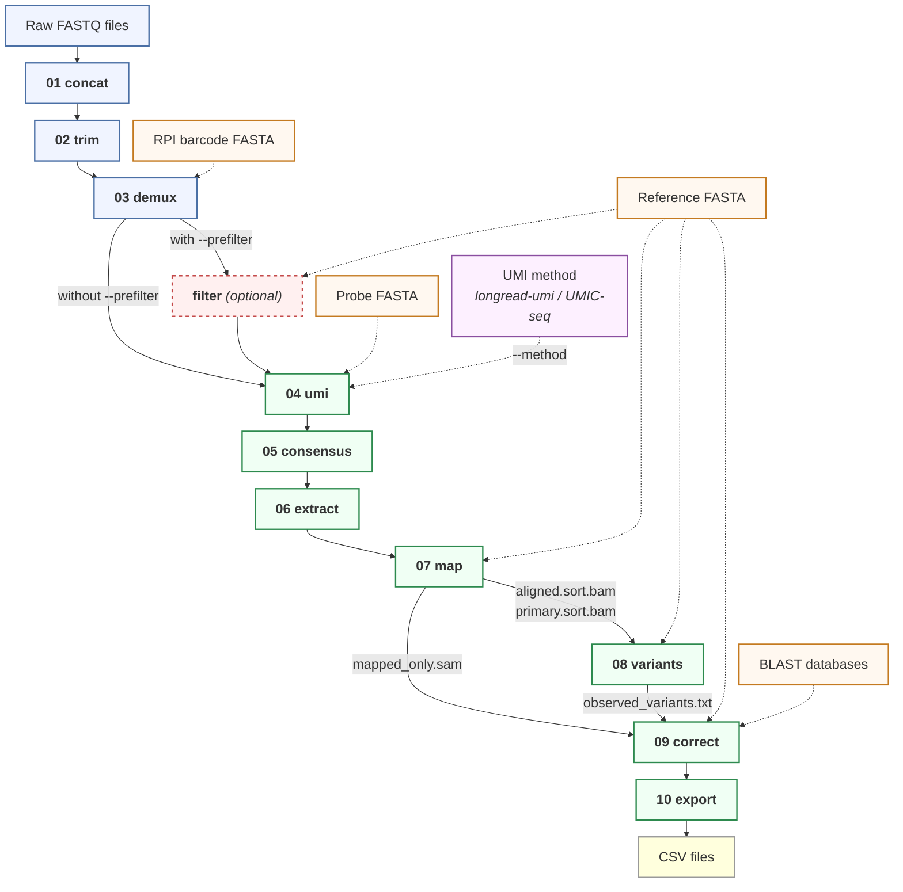

# L3Rseq

L3Rseq is the bioinformatics pipeline for **L3R-seq** (Long-read 3' RACE-seq), a targeted long-read sequencing method for deep quantitative analysis of RNA processing. The method ligates a UMI-containing adapter ([Scheer et al. 2020](https://doi.org/10.1007/978-1-4939-9822-7_8)) to the 3' end of RNA molecules prior to reverse transcription and PCR amplification. By grouping cDNA reads sharing the same UMI and generating a consensus sequence for each original RNA molecule, L3R-seq corrects random sequencing errors and mitigates PCR-duplicate-driven quantification biases.

L3Rseq enables simultaneous, per-molecule analysis of RNA editing, 3' end cleavage and trimming, and polyadenylation status, starting from raw Oxford Nanopore FASTQ files. Results are exported as per-molecule CSV tables for downstream analysis and can be explored visually through a built-in [alignment viewer](docs/advanced.md#alignment-viewer) that sorts and colors reads by their biological annotations. The workflow is also transferable to the PacBio platform.

L3Rseq was developed for analyzing the *Arabidopsis thaliana* mitochondrial *ccmC* mRNA — a transcript with extensive C-to-U editing and non-canonical 3' end processing — but is adaptable to any target RNA. See [Adapting to your experiment](docs/advanced.md#adapting-to-your-experiment) for how to configure it for your gene and organism.

<!-- TODO: Add library prep schematic showing adapter ligation, RT, PCR, and nanopore sequencing -->
<!--  -->

<!-- TODO: Add analysis overview figure showing per-molecule readout -->
<!--  -->

## Contents

1. [Quick start](#1-quick-start)
2. [Pipeline overview](#2-pipeline-overview)
3. [Key features](#3-key-features)
4. [Running on real data](#4-running-on-real-data)
5. [Output](#5-output)
6. [SAM tags](#6-sam-tags)
7. [License](#7-license)
8. [Citation](#8-citation)
9. [Acknowledgments](#9-acknowledgments)

**More documentation:**
[Advanced usage](docs/advanced.md) (adapting, viewer, CIGAR-walk, splicing) | [Testing](docs/testing.md) | [Development](docs/development.md) | [Requirements](docs/requirements.md)

## 1. Quick start

### What you need

1. **Demultiplexed FASTQ files** — basecalled (SUP model recommended) and native-barcode-demultiplexed by dorado (see the [manuscript](#8-citation) for the wet-lab, basecalling, and demultiplexing protocol)
2. **A reference FASTA** — the genomic (DNA) sequence of your target gene, covering the target region plus downstream sequence
3. **Sample barcode FASTA** (if starting from [step 01](#2-pipeline-overview)) — one entry per RPI (sample-specific index primer; 20 nt)

### A. GitHub Codespaces / devcontainer (no installation required)

Best for quickly trying out the tool — run the test suite, explore the viewer, and see what the pipeline does before setting up a local environment.

1. Click **Code** > **Codespaces** > **Create codespace** on this repository
2. Select **L3Rseq Pipeline** (the default) and wait ~1 min
3. You now have a fully configured Linux terminal with all tools pre-installed

> **Tip:** You can also open this devcontainer locally with [VS Code](https://code.visualstudio.com/) + the [Dev Containers extension](https://marketplace.visualstudio.com/items?itemName=ms-vscode-remote.remote-containers) — clone the repo, then use **Reopen in Container** from the command palette.

Inside the Codespace or devcontainer, run the pipeline directly:

```bash
# Verify installation (runs synthetic test suite)
bash tests/run_tests.sh --skip-preprocess

# Run on your data (mount or upload your FASTQs into the workspace)
L3Rseq run --input data/ --outdir results/ --ref refs/gene.fasta \
    --rpi-fasta refs/barcodes.fasta --pattern CT

# View results — check the Ports tab for the URL
L3Rseq viewer --dir results/
```

### B. Docker — pre-built image (recommended for local data)

#### B1. Pull the image

Install [Docker](https://docs.docker.com/get-docker/) if you don't have it, then pull the pre-built image:

```bash
docker pull ghcr.io/akihitomamiya-del/l3rseq:latest
```

Tested on macOS (Apple Silicon) and Linux (x86_64).

#### B2. Run the pipeline

You can run commands either from the **host** (passing them to `docker run`) or from **inside the container** (interactive shell):

**From the host** (`docker run`):
```bash
docker run --rm \
    --user "$(id -u):$(id -g)" \
    -v ~/data/fastq:/data/input:ro \
    -v ~/results:/data/output \
    ghcr.io/akihitomamiya-del/l3rseq:latest \
    L3Rseq run --input /data/input --outdir /data/output \
    --ref /data/input/reference.fa --pattern CT
```

**Inside the container** (interactive shell):
```bash
# Start an interactive session
docker run --rm -it \
    -v ~/data/fastq:/data/input:ro \
    -v ~/results:/data/output \
    ghcr.io/akihitomamiya-del/l3rseq:latest bash

# Now run commands directly
L3Rseq run --input /data/input --outdir /data/output \
    --ref /data/input/reference.fa --pattern CT

# View results (access via http://localhost:8080 on your host)
L3Rseq viewer --dir /data/output
```

**docker compose** (for repeated use — saves your paths in a config file):
```bash
cp .env.example .env   # edit this file with your paths and UID/GID
docker compose run l3rseq L3Rseq run \
    --input /data/input --outdir /data/output \
    --ref /data/input/reference.fa --pattern CT
```

**Wrapper script** (shorthand — handles mounts and file ownership for you):
```bash
./l3rseq-docker --input ~/data/fastq --outdir ~/results \
    --ref /data/input/reference.fa --pattern CT
```

#### B3. How data mounts work

Your data is not copied into the container. Instead, directories on your machine are mounted into the container:

| Container path | Your path | Access | Contains |
|---|---|---|---|
| `/data/input` | Your FASTQ directory | Read-only | Raw reads, reference FASTA, barcode FASTA |
| `/data/output` | Your results directory | Read-write | Pipeline output (01_concat/ through 10_csv/) |

The read-only flag on `/data/input` is enforced by the kernel — the pipeline cannot modify or delete your source data. Use a dedicated empty directory for `/data/output`.

On Linux, `--user "$(id -u):$(id -g)"` ensures output files are owned by your host user. On macOS and WSL2, Docker Desktop handles file ownership automatically.

## 2. Pipeline overview

Basecalled, native-barcode-demultiplexed reads from dorado are preprocessed: per-barcode FASTQs are concatenated (step 01), library preparation adapters are trimmed using cutadapt (step 02), and reads are demultiplexed by the RPI barcodes introduced during PCR (step 03). An optional pre-filter retains only on-target reads by rough mapping.

UMIs are extracted and reads sharing the same UMI — i.e. reads derived from the same original RNA molecule — are grouped by clustering (step 04). Within each cluster, reads are aligned and polished through iterative rounds of racon to produce a single high-accuracy consensus sequence (step 05). The consensus is trimmed to the target region using cutadapt (step 06), mapped to a reference with minimap2 (step 07), and scanned for single-nucleotide variants with LoFreq (step 08). A [CIGAR-walk algorithm](docs/advanced.md#how-cigar-walk-works) then corrects 3' soft-clip boundaries that were mis-assigned because edited bases near the transcript end appear as mismatches against the genomic reference (step 09). Right-clipped sequences exceeding 50 bp are additionally searched by BLAST against the organellar genome to detect translocation or chimeric artifacts. Finally, per-molecule annotations are exported to CSV for downstream analysis in R, Python, or spreadsheets (step 10).



```
01 concat     Concatenate per-barcode FASTQ files
02 trim       3-pass adapter trimming (cutadapt)
03 demux      RPI barcode demultiplexing (cutadapt)
   filter     Optional: retain only on-target reads by rough mapping
04 umi        UMI extraction and read grouping
05 consensus  Racon-based consensus calling
06 extract    Target region extraction (cutadapt)
07 map        Mapping to reference (minimap2)
08 variants   Variant calling (LoFreq)
09 correct    3' tail correction with CIGAR-walk
10 export     CSV export + quality report
```

### Running the full pipeline

```bash
L3Rseq run --input raw_fastq/ --outdir out/ --ref ref.fa --rpi-fasta barcodes.fa --pattern CT
```

This runs all 10 steps. Use `--start-at` and `--stop-at` to run a subset:

```bash
# From pre-demuxed reads (skip preprocessing steps 01-03)
L3Rseq run --input demuxed/ --outdir out/ --ref ref.fa --start-at 4

# From consensus FASTA (skip steps 01-05)
L3Rseq run --input consensus/ --outdir out/ --ref ref.fa --start-at 6

# Preprocess only (stop after demultiplexing)
L3Rseq run --input raw_fastq/ --outdir out/ --ref ref.fa --rpi-fasta barcodes.fa --stop-at 3
```

### Running individual steps

Each pipeline step is also available as a standalone subcommand. This is useful for re-running a single step with different parameters, or for debugging:

```bash
# Preprocessing
L3Rseq concat   --input raw_fastq/ --outdir out/     # 01: concatenate per-barcode FASTQs
L3Rseq trim     --input out/       --outdir out/     # 02: adapter trimming
L3Rseq demux    --input out/       --outdir out/ --rpi-fasta barcodes.fa  # 03: RPI demux

# Optional: pre-filter by rough mapping
L3Rseq filter   --input out/       --outdir out/ --ref ref.fa

# Core pipeline
L3Rseq umi       --input out/ --outdir out/                              # 04: UMI clustering
L3Rseq consensus --input out/ --outdir out/                              # 05: consensus calling
L3Rseq extract   --input out/ --outdir out/                              # 06: target extraction
L3Rseq map       --input out/ --outdir out/ --ref ref.fa                 # 07: mapping
L3Rseq variants  --input out/ --outdir out/ --ref ref.fa --pattern CT    # 08: variant calling
L3Rseq correct   --input out/ --outdir out/ --ref ref.fa --pattern CT    # 09: tail correction
L3Rseq export    --input out/ --outdir out/                              # 10: CSV export
```

For subcommand-specific help: `L3Rseq <subcommand> --help`

## 3. Key features

**Analysis capabilities**

- **UMI consensus** — groups reads sharing the same UMI into clusters and polishes each cluster into a single high-accuracy consensus sequence
- **RNA editing quantification** — counts editing events per read (C-to-U by default; configurable via `--pattern` for other editing types such as A-to-G, or comma-separated for dual patterns like `--pattern CT,AG`)
- **3' tail correction** — CIGAR-walk algorithm corrects 3' soft-clip boundaries that are mis-assigned when edited bases near the transcript end look like mismatches (see [How CIGAR-walk works](docs/advanced.md#how-cigar-walk-works))
- **Splicing detection** — `--introns` classifies reads as spliced/unspliced with per-intron resolution; `discover-introns` can automatically detect intron coordinates from your data without prior annotation
- **Noise separation** — per-read noise count (NC tag) distinguishes biological editing from residual sequencing errors in the consensus
- **Secondary pattern** — `--count-pattern TC` for SLAM-seq T-to-C counting alongside primary editing
- **Built-in alignment viewer** — browser-based [IGV.js viewer](docs/advanced.md#alignment-viewer) with custom SAM tag support: sort and color reads by editing count, splice status, 3' tail length, noise, and more. Lets you visually inspect per-molecule annotations directly on the alignment without leaving the pipeline

<!-- TODO: Add viewer screenshot showing color-by-EC or sort-by-SJ -->
<!--  -->

**Workflow**

- **Flexible entry point** — enter at any step with `--start-at` / `--stop-at`
- **Resume on re-run** — if a run is interrupted, re-running the same command skips already-completed samples automatically

## 4. Running on real data

Once your installation is verified, here is how to run L3Rseq on your own nanopore data. See also `examples/run_pipeline.sh` for a copy-and-edit template script.

### 4.1 Prepare your inputs

You need three files:

| File | Example | Notes |
|---|---|---|
| Raw FASTQs | `data/barcode48/` | Per-barcode directory of `.fastq.gz` files from dorado demux |
| Reference FASTA | `refs/my_gene.fasta` | Genomic sequence covering your target + downstream region |
| Sample barcode FASTA | `refs/rpi_barcodes.fasta` | One entry per sample-specific index primer (20 nt; see manuscript for primer design) |

Optional: a probe FASTA (only needed for `--method umic-seq`).

### 4.2 Full pipeline

```bash
L3Rseq run \
  --input  data/             \  # directory containing barcode subdirs
  --outdir results/          \
  --ref    refs/my_gene.fasta \
  --rpi-fasta refs/rpi_barcodes.fasta \
  --pattern CT               \  # C-to-U RNA editing (default)
  --threads 8
```

This runs all 10 steps. Output lands in `results/01_concat/` through `results/10_csv/`.

### 4.3 Common options

```bash
# Splicing: classify reads as spliced/unspliced
L3Rseq run ... --introns "847-2891"

# UMIC-seq method (instead of default longread-umi)
L3Rseq run ... --method umic-seq --probe refs/probe.fasta

# Custom BLAST databases for translocation/chimera detection
L3Rseq run ... \
  --blast-db  refs/blast/organelle_db \
  --blast-db2 refs/blast/transcriptome_db

# Pre-filter reads by rough mapping (reduces noise from off-target reads)
L3Rseq run ... --prefilter

# SLAM-seq: track 4sU T-to-C conversions alongside C-to-U editing
L3Rseq run ... --pattern CT --count-pattern TC

# Dual editing patterns: count both C-to-T and A-to-G as editing (EC)
L3Rseq run ... --pattern CT,AG
```

### 4.4 Processing specific samples

After demultiplexing (step 03), you may want to process only certain samples. Run steps 1-3 first, then filter and continue:

```bash
# Steps 1-3: preprocess all samples
L3Rseq run --input data/ --outdir results/ --ref refs/gene.fasta \
  --rpi-fasta refs/barcodes.fasta --stop-at 3

# Check which samples have reads (most with <30 are barcode crosstalk)
wc -l results/03_demux/barcode*/*.fastq | sort -rn | head

# Keep only the samples you want (e.g., RPI 3 and 4)
mv results/03_demux results/03_demux_all
mkdir -p results/03_demux/barcode48
for rpi in 3 4; do
  ln -s "$(pwd)/results/03_demux_all/barcode48/barcode48_RPI_${rpi}.fastq" \
        results/03_demux/barcode48/
done

# Steps 4-10: process only selected samples
L3Rseq run --input results/ --outdir results/ --ref refs/gene.fasta \
  --rpi-fasta refs/barcodes.fasta --pattern CT --start-at 4
```

### 4.5 Inspect results

```bash
# Per-molecule CSV (main output for downstream analysis)
head results/10_csv/barcode48_barcode48_RPI_3.csv

# Quality report
cat results/10_csv/barcode48_barcode48_RPI_3_quality_report.txt

# Pipeline summary (read counts at each step)
column -t results/pipeline_summary.tsv

# UMI bin analysis: plot consensus quality vs. min reads per bin
# (helps you decide whether to adjust the bin size threshold for your data)
conda run -n analysis python3 scripts/plot_umi_bins.py results/ --quality --outdir runs/figures/

# View alignments in browser
L3Rseq viewer
# Open http://localhost:8080, select your dataset
```

### 4.6 Build BLAST databases (optional)

BLAST databases enable translocation detection and chimera filtering in step 09. If you're working with a non-*Arabidopsis* organism:

```bash
bash scripts/setup_blast_db.sh \
  --organelle-fasta refs/my_mitochondrial_genome.fasta \
  --transcriptome-fasta refs/my_cDNA.fasta

L3Rseq run ... \
  --blast-db  resources/blast/organelle/organelle_db \
  --blast-db2 resources/blast/transcriptome/transcriptome_db
```

Without BLAST databases, step 09 still runs — it just skips the translocation check and reports all right-clips as non-chimeric.

## 5. Output

The main outputs are in `10_csv/`:

- **`{barcode}_{RPI}.csv`** — one row per original RNA molecule. Key columns:
  - `ThreePrime_end` — position on the reference where the transcript's 3' end maps
  - `ThreePrime_tail_length` / `ThreePrime_tail_seq` — length and sequence of the non-templated 3' extension (e.g., poly(A) tail)
  - `editing_count` (EC) — number of C-to-U (or user-specified) editing events in this molecule
  - `secondary_editing_count` (SC) — secondary pattern count (e.g., T-to-C for SLAM-seq via `--count-pattern TC`; only present when `--count-pattern` is used)
  - `noise_count` (NC) — non-biological substitutions remaining after editing is accounted for (a quality metric)
  - `All_mismatches` (VR) — semicolon-separated list of every detected variant vs. reference

  This table is the primary input for downstream statistical analysis (e.g., correlating editing status with 3' end position across molecules).

- **`{barcode}_{RPI}_quality_report.txt`** — aggregate quality metrics including Q scores, substitution types, indel analysis, and splicing efficiency (if `--introns` used)
- **`pipeline_summary.tsv`** — timestamped per-step metrics for QC

## 6. SAM tags

Step 09 (tail correction) annotates each read with custom SAM tags. These are visible when clicking a read in the [alignment viewer](docs/advanced.md#alignment-viewer) and are exported to CSV by step 10.

**Editing & quality**

| Tag | Type | Description |
|---|---|---|
| EC | i | Primary editing count (e.g., C-to-U for `--pattern CT`) |
| SC | i | Secondary editing count (e.g., T-to-C for `--count-pattern TC`); only present when `--count-pattern` is used |
| NC | i | Noise count — non-biological substitutions (total mismatches minus EC minus SC) |
| VR | Z | All detected variants, semicolon-separated (e.g., `123CT;456CT;`) |

**3' end & tail**

| Tag | Type | Description |
|---|---|---|
| 3E | i | 3' end position on the reference |
| RC | i | Remaining right-clip length after CIGAR-walk correction |
| RS | Z | Remaining right-clip sequence (the non-templated 3' extension, e.g., poly(A) tail) |
| TL | i | Translocation flag: 0 = normal, 1 = right-clip matches organellar genome by BLAST (chimeric artifact) |
| mL | i | Matched alignment length (sum of M and D operations from CIGAR) |
| DS | i | Double-sorter value (3' end position x 10000 + right-clip length; used for read sorting in the viewer) |

**Splicing** (only present when `--introns` is used)

| Tag | Type | Description |
|---|---|---|
| SJ | Z | Splice junction pattern — one character per annotated intron: `S` = spliced, `R` = retained (unspliced), `-` = read does not span that intron |
| SI | i | Number of introns detected as spliced |
| IR | i | Number of introns detected as retained |

## 7. License

GPL-3.0 (required by UMIC-seq and longread_umi dependencies). See [LICENSE](LICENSE).

## 8. Citation

If you use L3Rseq in your research, please cite:

> Mamiya A, Takenaka M, Sugiyama M. L3R-seq: A long-read 3'RACE approach for deep quantitative analysis of RNA processing. In: *Methods in Molecular Biology*. Springer. (in press)

## 9. Acknowledgments

L3Rseq bundles and builds on two open-source projects, both licensed under GPL-3.0. Please cite the original authors when using these components:

**longread_umi** — UMI binning and consensus calling ([GitHub](https://github.com/SorenKarst/longread_umi))

> Karst SM, Ziels RM, Kirkegaard RH, Sorensen EA, McDonald D, Zhu Q, Knight R, Albertsen M. (2021). High-accuracy long-read amplicon sequences using unique molecular identifiers with Nanopore or PacBio sequencing. *Nature Methods*, 18, 165-169. https://doi.org/10.1038/s41592-020-01041-y

**UMIC-seq** — UMI extraction and clustering ([GitHub](https://github.com/fhlab/UMIC-seq))

> Zurek PJ, Knyphausen P, Neufeld K, Pushpanath A, Hollfelder F. (2020). UMI-linked consensus sequencing enables phylogenetic analysis of directed evolution. *Nature Communications*, 11, 6023. https://doi.org/10.1038/s41467-020-19687-9

Modifications to bundled code are documented in [longread_umi_L3Rseq/ATTRIBUTION.md](longread_umi_L3Rseq/ATTRIBUTION.md) and [UMIC-seq_L3Rseq/ATTRIBUTION.md](UMIC-seq_L3Rseq/ATTRIBUTION.md).
