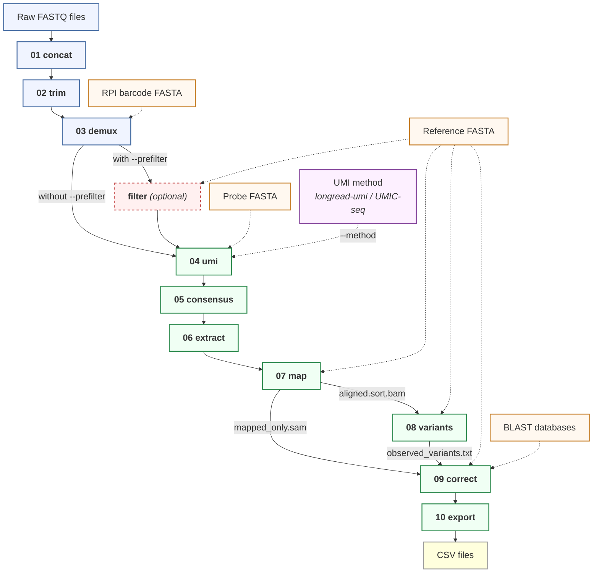

# L3Rseq

L3Rseq is the bioinformatics pipeline for **L3R-seq** (Long-read 3' RACE-seq), a targeted long-read sequencing method for deep quantitative analysis of RNA processing. The method ligates a UMI-containing adapter ([Scheer et al. 2020](https://doi.org/10.1007/978-1-0716-0507-7_5)) to the 3' end of RNA molecules prior to reverse transcription and PCR amplification. By grouping cDNA reads sharing the same UMI and generating a consensus sequence for each original RNA molecule, L3R-seq corrects random sequencing errors and mitigates PCR-duplicate-driven quantification biases.

L3Rseq enables simultaneous, per-molecule analysis of RNA editing, 3' end cleavage and trimming, and polyadenylation status, starting from raw Oxford Nanopore FASTQ files. Results are exported as per-molecule CSV tables for downstream analysis and can be explored visually through a built-in [alignment viewer](#8-alignment-viewer) that sorts and colors reads by their biological annotations. The workflow is also transferable to the PacBio platform.

L3Rseq was developed for analyzing the *Arabidopsis thaliana* mitochondrial *ccmC* mRNA — a transcript with extensive C-to-U editing and non-canonical 3' end processing — but is adaptable to any target RNA. See [Adapting to your experiment](#7-adapting-to-your-experiment) for how to configure it for your gene and organism.

## Contents

1. [Quick start](#1-quick-start)
2. [Pipeline overview](#2-pipeline-overview)
3. [Key features](#3-key-features)
4. [Running on real data](#4-running-on-real-data)
5. [Output](#5-output)
6. [SAM tags](#6-sam-tags)
7. [Adapting to your experiment](#7-adapting-to-your-experiment)
8. [Alignment viewer](#8-alignment-viewer)
9. [How CIGAR-walk works](#9-how-cigar-walk-works)
10. [Intron splicing support](#10-intron-splicing-support)
11. [Testing](#11-testing)
12. [UMI bin size analysis](#12-umi-bin-size-analysis)
13. [Development](#13-development)
14. [Requirements](#14-requirements)
15. [License](#15-license)
16. [Citation](#16-citation)
17. [Acknowledgments](#17-acknowledgments)

## 1. Quick start

### What you need

1. **Demultiplexed FASTQ files** — basecalled (SUP model recommended) and native-barcode-demultiplexed by dorado (see the [manuscript](#16-citation) for the wet-lab, basecalling, and demultiplexing protocol)
2. **A reference FASTA** — the genomic (DNA) sequence of your target gene, covering the target region plus downstream sequence
3. **Sample barcode FASTA** (if starting from [step 01](#2-pipeline-overview)) — one entry per RPI (sample-specific index primer; 20 nt)

### A. GitHub Codespaces (no installation required)

Best for quickly trying out the tool — run the test suite, explore the viewer, and see what the pipeline does before setting up a local environment.

1. Click **Code** > **Codespaces** > **Create codespace** on this repository
2. Select **L3Rseq Pipeline** (the default) and wait ~1 min
3. You now have a fully configured Linux terminal with all tools pre-installed

> **Tip:** You can also open this devcontainer locally with [VS Code](https://code.visualstudio.com/) + the [Dev Containers extension](https://marketplace.visualstudio.com/items?itemName=ms-vscode-remote.remote-containers) — clone the repo, then use **Reopen in Container** from the command palette.

### B. Docker — pre-built image (recommended for local data)

#### B1. Pull the image

Install [Docker](https://docs.docker.com/get-docker/) if you don't have it, then pull the pre-built image:

```bash
docker pull ghcr.io/akihitomamiya-del/l3rseq:latest
```

The image supports Intel and Apple Silicon Macs, Linux, and Windows (WSL2).

#### B2. Run the pipeline

**docker run**:
```bash
docker run --rm \
    --user "$(id -u):$(id -g)" \
    -v ~/data/fastq:/data/input:ro \
    -v ~/results:/data/output \
    ghcr.io/akihitomamiya-del/l3rseq:latest \
    L3Rseq run --input /data/input --outdir /data/output \
    --ref /data/input/reference.fa --pattern CT
```

**docker compose** (for repeated use — saves your paths in a config file):
```bash
cp .env.example .env   # edit this file with your paths and UID/GID
docker compose run l3rseq L3Rseq run \
    --input /data/input --outdir /data/output \
    --ref /data/input/reference.fa --pattern CT
```

**Wrapper script** (shorthand — handles mounts and file ownership for you):
```bash
./l3rseq-docker --input ~/data/fastq --outdir ~/results \
    --ref /data/input/reference.fa --pattern CT
```

#### B3. How data mounts work

Your data is not copied into the container. Instead, directories on your machine are mounted into the container:

| Container path | Your path | Access | Contains |
|---|---|---|---|
| `/data/input` | Your FASTQ directory | Read-only | Raw reads, reference FASTA, barcode FASTA |
| `/data/output` | Your results directory | Read-write | Pipeline output (01_concat/ through 10_csv/) |

The read-only flag on `/data/input` is enforced by the kernel — the pipeline cannot modify or delete your source data. Use a dedicated empty directory for `/data/output`.

On Linux, `--user "$(id -u):$(id -g)"` ensures output files are owned by your host user. On macOS and WSL2, Docker Desktop handles file ownership automatically.

### Verify your installation

Inside the container or Codespace, run:

```bash
bash tests/run_tests.sh --skip-preprocess
```

This runs 98 checks on synthetic data (~2 min) and confirms all tools are working. After the tests complete, you can view the test output alignments in the IGV viewer — see [Alignment viewer](#8-alignment-viewer) for details.

## 2. Pipeline overview

Basecalled, native-barcode-demultiplexed reads from dorado are preprocessed: per-barcode FASTQs are concatenated (step 01), library preparation adapters are trimmed using cutadapt (step 02), and reads are demultiplexed by the RPI barcodes introduced during PCR (step 03). An optional pre-filter retains only on-target reads by rough mapping.

UMIs are extracted and reads sharing the same UMI — i.e. reads derived from the same original RNA molecule — are grouped by clustering (step 04). Within each cluster, reads are aligned and polished through iterative rounds of racon to produce a single high-accuracy consensus sequence (step 05). The consensus is trimmed to the target region using cutadapt (step 06), mapped to a reference with minimap2 (step 07), and scanned for single-nucleotide variants with LoFreq (step 08). A CIGAR-walk algorithm then corrects 3' soft-clip boundaries that were mis-assigned because edited bases near the transcript end appear as mismatches against the genomic reference (step 09). Right-clipped sequences exceeding 50 bp are additionally searched by BLAST against the organellar genome to detect translocation or chimeric artifacts. Finally, per-molecule annotations are exported to CSV for downstream analysis in R, Python, or spreadsheets (step 10).



```
01 concat     Concatenate per-barcode FASTQ files
02 trim       3-pass adapter trimming (cutadapt)
03 demux      RPI barcode demultiplexing (cutadapt)
   filter     Optional: retain only on-target reads by rough mapping
04 umi        UMI extraction and read grouping
05 consensus  Racon-based consensus calling
06 extract    Target region extraction (cutadapt)
07 map        Mapping to reference (minimap2)
08 variants   Variant calling (LoFreq)
09 correct    3' tail correction with CIGAR-walk
10 export     CSV export + quality report
```

### Running the full pipeline

```bash
L3Rseq run --input raw_fastq/ --outdir out/ --ref ref.fa --rpi-fasta barcodes.fa --pattern CT
```

This runs all 10 steps. Use `--start-at` and `--stop-at` to run a subset:

```bash
# From pre-demuxed reads (skip preprocessing steps 01-03)
L3Rseq run --input demuxed/ --outdir out/ --ref ref.fa --start-at 4

# From consensus FASTA (skip steps 01-05)
L3Rseq run --input consensus/ --outdir out/ --ref ref.fa --start-at 6

# Preprocess only (stop after demultiplexing)
L3Rseq run --input raw_fastq/ --outdir out/ --ref ref.fa --rpi-fasta barcodes.fa --stop-at 3
```

### Running individual steps

Each pipeline step is also available as a standalone subcommand. This is useful for re-running a single step with different parameters, or for debugging:

```bash
# Preprocessing
L3Rseq concat   --input raw_fastq/ --outdir out/     # 01: concatenate per-barcode FASTQs
L3Rseq trim     --input out/       --outdir out/     # 02: adapter trimming
L3Rseq demux    --input out/       --outdir out/ --rpi-fasta barcodes.fa  # 03: RPI demux

# Optional: pre-filter by rough mapping
L3Rseq filter   --input out/       --outdir out/ --ref ref.fa

# Core pipeline
L3Rseq umi       --input out/ --outdir out/                              # 04: UMI clustering
L3Rseq consensus --input out/ --outdir out/                              # 05: consensus calling
L3Rseq extract   --input out/ --outdir out/                              # 06: target extraction
L3Rseq map       --input out/ --outdir out/ --ref ref.fa                 # 07: mapping
L3Rseq variants  --input out/ --outdir out/ --ref ref.fa --pattern CT    # 08: variant calling
L3Rseq correct   --input out/ --outdir out/ --ref ref.fa --pattern CT    # 09: tail correction
L3Rseq export    --input out/ --outdir out/                              # 10: CSV export
```

For subcommand-specific help: `L3Rseq <subcommand> --help`

## 3. Key features

**Analysis capabilities**

- **UMI consensus** — groups reads sharing the same UMI into clusters and polishes each cluster into a single high-accuracy consensus sequence
- **RNA editing quantification** — counts editing events per read (C-to-U by default; configurable via `--pattern` for other editing types such as A-to-G, or comma-separated for dual patterns like `--pattern CT,AG`)
- **3' tail correction** — CIGAR-walk algorithm corrects 3' soft-clip boundaries that are mis-assigned when edited bases near the transcript end look like mismatches (see [How CIGAR-walk works](#9-how-cigar-walk-works) below)
- **Splicing detection** — `--introns` classifies reads as spliced/unspliced with per-intron resolution; `discover-introns` can automatically detect intron coordinates from your data without prior annotation
- **Noise separation** — per-read noise count (NC tag) distinguishes biological editing from residual sequencing errors in the consensus
- **Secondary pattern** — `--count-pattern TC` for SLAM-seq T-to-C counting alongside primary editing
- **Built-in alignment viewer** — browser-based [IGV.js viewer](#8-alignment-viewer) with custom SAM tag support: sort and color reads by editing count, splice status, 3' tail length, noise, and more. Lets you visually inspect per-molecule annotations directly on the alignment without leaving the pipeline

**Workflow**

- **Flexible entry point** — enter at any step with `--start-at` / `--stop-at`
- **Resume on re-run** — if a run is interrupted, re-running the same command skips already-completed samples automatically

## 4. Running on real data

Once your installation is verified, here is how to run L3Rseq on your own nanopore data. See also `examples/run_pipeline.sh` for a copy-and-edit template script.

### 4.1 Prepare your inputs

You need three files:

| File | Example | Notes |
|---|---|---|
| Raw FASTQs | `data/barcode48/` | Per-barcode directory of `.fastq.gz` files from dorado demux |
| Reference FASTA | `refs/my_gene.fasta` | Genomic sequence covering your target + downstream region |
| Sample barcode FASTA | `refs/rpi_barcodes.fasta` | One entry per sample-specific index primer (20 nt; see manuscript for primer design) |

Optional: a probe FASTA (only needed for `--method umic-seq`).

### 4.2 Full pipeline

```bash
L3Rseq run \
  --input  data/             \  # directory containing barcode subdirs
  --outdir results/          \
  --ref    refs/my_gene.fasta \
  --rpi-fasta refs/rpi_barcodes.fasta \
  --pattern CT               \  # C-to-U RNA editing (default)
  --threads 8
```

This runs all 10 steps. Output lands in `results/01_concat/` through `results/10_csv/`.

### 4.3 Common options

```bash
# Splicing: classify reads as spliced/unspliced
L3Rseq run ... --introns "847-2891"

# UMIC-seq method (instead of default longread-umi)
L3Rseq run ... --method umic-seq --probe refs/probe.fasta

# Custom BLAST databases for translocation/chimera detection
L3Rseq run ... \
  --blast-db  refs/blast/organelle_db \
  --blast-db2 refs/blast/transcriptome_db

# Pre-filter reads by rough mapping (reduces noise from off-target reads)
L3Rseq run ... --prefilter

# SLAM-seq: track 4sU T-to-C conversions alongside C-to-U editing
L3Rseq run ... --pattern CT --count-pattern TC

# Dual editing patterns: count both C-to-T and A-to-G as editing (EC)
L3Rseq run ... --pattern CT,AG
```

### 4.4 Processing specific samples

After demultiplexing (step 03), you may want to process only certain samples. Run steps 1-3 first, then filter and continue:

```bash
# Steps 1-3: preprocess all samples
L3Rseq run --input data/ --outdir results/ --ref refs/gene.fasta \
  --rpi-fasta refs/barcodes.fasta --stop-at 3

# Check which samples have reads (most with <30 are barcode crosstalk)
wc -l results/03_demux/barcode*/*.fastq | sort -rn | head

# Keep only the samples you want (e.g., RPI 3 and 4)
mv results/03_demux results/03_demux_all
mkdir -p results/03_demux/barcode48
for rpi in 3 4; do
  ln -s "$(pwd)/results/03_demux_all/barcode48/barcode48_RPI_${rpi}.fastq" \
        results/03_demux/barcode48/
done

# Steps 4-10: process only selected samples
L3Rseq run --input results/ --outdir results/ --ref refs/gene.fasta \
  --rpi-fasta refs/barcodes.fasta --pattern CT --start-at 4
```

### 4.5 Inspect results

```bash
# Per-molecule CSV (main output for downstream analysis)
head results/10_csv/barcode48_barcode48_RPI_3.csv

# Quality report
cat results/10_csv/barcode48_barcode48_RPI_3_quality_report.txt

# Pipeline summary (read counts at each step)
column -t results/pipeline_summary.tsv

# UMI bin analysis: plot consensus quality vs. min reads per bin
# (helps you decide whether to adjust the bin size threshold for your data)
conda run -n analysis python3 scripts/plot_umi_bins.py results/ --quality --outdir runs/figures/

# View alignments in browser
L3Rseq viewer
# Open http://localhost:8080, select your dataset
```

### 4.6 Build BLAST databases (optional)

BLAST databases enable translocation detection and chimera filtering in step 09. If you're working with a non-*Arabidopsis* organism:

```bash
bash scripts/setup_blast_db.sh \
  --organelle-fasta refs/my_mitochondrial_genome.fasta \
  --transcriptome-fasta refs/my_cDNA.fasta

L3Rseq run ... \
  --blast-db  resources/blast/organelle/organelle_db \
  --blast-db2 resources/blast/transcriptome/transcriptome_db
```

Without BLAST databases, step 09 still runs — it just skips the translocation check and reports all right-clips as non-chimeric.

## 5. Output

The main outputs are in `10_csv/`:

- **`{barcode}_{RPI}.csv`** — one row per original RNA molecule. Key columns:
  - `ThreePrime_end` — position on the reference where the transcript's 3' end maps
  - `ThreePrime_tail_length` / `ThreePrime_tail_seq` — length and sequence of the non-templated 3' extension (e.g., poly(A) tail)
  - `editing_count` (EC) — number of C-to-U (or user-specified) editing events in this molecule
  - `secondary_editing_count` (SC) — secondary pattern count (e.g., T-to-C for SLAM-seq via `--count-pattern TC`; only present when `--count-pattern` is used)
  - `noise_count` (NC) — non-biological substitutions remaining after editing is accounted for (a quality metric)
  - `All_mismatches` (VR) — semicolon-separated list of every detected variant vs. reference

  This table is the primary input for downstream statistical analysis (e.g., correlating editing status with 3' end position across molecules).

- **`{barcode}_{RPI}_quality_report.txt`** — aggregate quality metrics including Q scores, substitution types, indel analysis, and splicing efficiency (if `--introns` used)
- **`pipeline_summary.tsv`** — timestamped per-step metrics for QC

## 6. SAM tags

Step 09 (tail correction) annotates each read with custom SAM tags. These are visible when clicking a read in the [alignment viewer](#8-alignment-viewer) and are exported to CSV by step 10.

**Editing & quality**

| Tag | Type | Description |
|---|---|---|
| EC | i | Primary editing count (e.g., C-to-U for `--pattern CT`) |
| SC | i | Secondary editing count (e.g., T-to-C for `--count-pattern TC`); only present when `--count-pattern` is used |
| NC | i | Noise count — non-biological substitutions (total mismatches minus EC minus SC) |
| VR | Z | All detected variants, semicolon-separated (e.g., `123CT;456CT;`) |

**3' end & tail**

| Tag | Type | Description |
|---|---|---|
| 3E | i | 3' end position on the reference |
| RC | i | Remaining right-clip length after CIGAR-walk correction |
| RS | Z | Remaining right-clip sequence (the non-templated 3' extension, e.g., poly(A) tail) |
| TL | i | Translocation flag: 0 = normal, 1 = right-clip matches organellar genome by BLAST (chimeric artifact) |
| mL | i | Matched alignment length (sum of M and D operations from CIGAR) |
| DS | i | Double-sorter value (3' end position × 10000 + right-clip length; used for read sorting in the viewer) |

**Splicing** (only present when `--introns` is used)

| Tag | Type | Description |
|---|---|---|
| SJ | Z | Splice junction pattern — one character per annotated intron: `S` = spliced, `R` = retained (unspliced), `-` = read does not span that intron |
| SI | i | Number of introns detected as spliced |
| IR | i | Number of introns detected as retained |

## 7. Adapting to your experiment

L3Rseq ships with default adapter sequences and reference files for the *Arabidopsis* ccmC gene. To use with a different organism or library:

| What to change | How |
|---|---|
| Reference sequence | `--ref your_gene.fa` |
| Sample barcodes (RPI) | `--rpi-fasta your_barcodes.fa` |
| UMI flanking sequences | `--umi-flank5 NNNNN --umi-flank3 NNNNN` |
| BLAST databases | `bash scripts/setup_blast_db.sh --organelle-fasta your_mtDNA.fa --transcriptome-fasta your_cDNA.fa` then `--blast-db` / `--blast-db2` |
| Adapter sequences | `L3Rseq trim --adapter-fwd ... --adapter-rev ...` (defaults match the protocol in the manuscript; override for different library designs) |
| Target extraction primers | `L3Rseq extract --target-fwd ... --target-rev ...` (users analyzing shorter amplicons may need to reduce `--min-overlap`) |
| Editing pattern | `--pattern AG` (for A-to-I editing), or `--pattern CT,AG` to count multiple editing types as primary editing |
| Known editing positions | `--var known_sites.txt` (use when a control sample with established editing sites is available, in addition to or instead of LoFreq-detected positions) |

## 8. Alignment viewer

L3Rseq includes a built-in [IGV.js](https://github.com/igvteam/igv.js) alignment viewer that runs in your browser. It auto-discovers BAM files from any pipeline output directory — no file upload or manual configuration needed.

**Features:**
- **Dataset selector** — dropdown lists all samples; any directory containing `07_map/` or `09_correct/` is detected automatically
- **Before/after tracks** — raw mapping (step 07) and tail-corrected reads (step 09) displayed side by side so you can see the effect of CIGAR-walk correction
- **Sort reads by SAM tag** — sort by editing count (EC), noise (NC), 3' end position (3E), splice status (SJ), translocation (TL), double-sorter (DS), and more
- **Group reads by SAM tag** — group by EC to see editing levels (including EC=0 unedited reads), SJ for splice status, TL for translocations
- **Color reads by SAM tag** — color by splice status (green = spliced, red = retained, gray = unknown), editing count, noise, strand, or translocation, with auto-generated legend
- **Click any read** to inspect all [SAM tags](#6-sam-tags) (editing counts, 3' tail sequence, splice junctions, etc.)

**Starting the viewer:**

```bash
L3Rseq viewer              # start on default port 8080
L3Rseq viewer --port 9090  # use a different port
L3Rseq viewer --stop       # stop the viewer
```

In **Codespaces**, the viewer starts automatically — check the **Ports** tab in VS Code for the URL.

**With Docker** (view pipeline output without entering the container):

```bash
docker run --rm -p 8080:8080 \
    -v ~/results:/data/output:ro \
    -e IGV_DATA_DIR=/data/output \
    ghcr.io/akihitomamiya-del/l3rseq:latest \
    bash -c 'cd /workspace/igv_viewer && node server.js'
```

Then open `http://localhost:8080` in your browser.

## 9. How CIGAR-walk works

In L3R-seq, the reference sequence represents the genomic (DNA) sequence. Because C-to-U RNA editing changes the transcript relative to the genome, edited positions near the 3' end of the aligned region appear as mismatches, causing the aligner to prematurely soft-clip the rest of the sequence. For example, a read with true alignment `527M10S` may be reported as `513M24S` because 14 edited bases near the 3' boundary look like mismatches.

The CIGAR-walk correction parses the right-clipped portion and performs a base-by-base comparison between the clipped sequence and the downstream reference, tolerating mismatches at positions known to undergo RNA editing (from step 08). The comparison proceeds until a non-editing mismatch or the end of the reference is encountered, at which point the CIGAR is rebuilt with updated match and soft-clip counts. The remaining soft-clipped sequence after correction represents the true non-templated 3' extension (e.g., poly(A) tail).

Right-clipped sequences exceeding 50 bp are additionally searched by BLAST against the organellar genome to detect translocation events (e.g., trans-splicing or DNA recombination). Reads with an organellar hit are flagged (`TL:i:1`). Reads with no organellar hit are searched against a cDNA database; those matching elsewhere (e.g., ribosomal RNA) are classified as chimeric artifacts and separated for manual review. A user-supplied file of known editing positions (`--var`) can be used in addition to or instead of the positions detected in step 08.

## 10. Intron splicing support

For genes with introns, L3Rseq can classify reads as spliced or unspliced:

```bash
# If you know the intron coordinates
L3Rseq run --introns "847-2891" ...

# Using a BED file (multiple introns)
L3Rseq run --introns introns.bed ...

# Using a GFF3 annotation
L3Rseq run --introns gene_annotation.gff3 ...

# Discover introns from the data
L3Rseq discover-introns --input out/07_map --outdir out/
# Review the report, then use the candidate BED file
L3Rseq run --introns out/candidate_introns.bed ...
```

## 11. Testing

```bash
bash tests/run_tests.sh                    # full suite (133 checks, ~65s)
bash tests/run_tests.sh --skip-preprocess  # steps 04-10 only (~55s)
bash tests/run_tests.sh --quick            # smoke test (~15s)
bash tests/run_tests.sh --no-viewer        # skip IGV viewer after tests
```

All tests use synthetic data with a 1.5kbp `test_gene` reference — no external data needed. Each sample has a distinct editing pattern (CT, AG, CT+AG, TC+SLAM) to test single and dual-pattern counting.

| Test | Steps | What it checks |
|---|---|---|
| Test 1 | 01-03 | Concat, trim, demux — read counts per barcode/RPI |
| Test 1b | filter | Optional filter step removes non-mapping reads |
| Test 1c | — | Error handling: missing --ref, bad --rpi-fasta, UMIC-seq without --probe |
| Test 2 | 04-10 | Full CT pipeline: UMI bins, consensus identity (>=99%), mapping, EC/NC tags, CSV |
| Test 2b | 08-10 | Dual-pattern `--pattern CT,AG`: EC counts increase for AG-containing samples |
| Test 3 | 09-10 | SLAM-seq: exact EC=96, SC=590, NC=101 on 40 synthetic reads |
| Test 4 | 09-10 | Splicing: SJ/SI/IR tags, splice pattern counts, intron discovery |
| Test 5 | 09-10 | BLAST: walk correction CIGARs, ChrM translocation, cDNA chimera filtering |
| Test 6 | — | IGV viewer API: datasets, tracks, pileup output, IGV.js patches |

### Docker image verification

From the host machine (not inside a container):

```bash
bash tests/test_docker_image.sh                    # build + test
bash tests/test_docker_image.sh --skip-build       # test existing image
bash tests/test_docker_image.sh --image ghcr.io/akihitomamiya-del/l3rseq:latest
```

### Regenerating test data

Generators in `tests/generators/` produce all synthetic data:

```bash
python3 tests/generators/generate_synthetic_data.py    # main pipeline data
python3 tests/generators/generate_blast_test_data.py   # BLAST + walk correction
python3 tests/generators/generate_slam_test_data.py    # SLAM-seq fixtures
python3 tests/generators/generate_splice_test_data.py  # splice fixtures
python3 tests/generators/generate_demo_data.py tests/output/demo  # IGV demo
```

## 12. UMI bin size analysis

Consensus quality depends on reads per UMI bin. Analysis on real data (*Arabidopsis* ccmC gene) shows quality plateaus at n>=3:

| Min reads per bin | Error-free consensus | Noise (/1000 bp) | Consensus reads retained |
|---|---|---|---|
| n>=1 | 48-80% | 0.5-4.4 | 4,727 |
| n>=2 | 78-80% | 0.5-0.7 | 4,727 |
| **n>=3** | **89%** | **0.22** | **3,423** |
| n>=4 | 93% | 0.13 | 2,147 |
| n>=5 | 95% | 0.11 | 1,192 |

The current default `min_bin_size=3` balances quality and yield. Generate your own bin analysis plots:

```bash
conda run -n analysis python3 scripts/plot_umi_bins.py results/ --quality
conda run -n analysis python3 scripts/plot_umi_bins.py results/ --quality --pattern CT,AG  # show both patterns
conda run -n analysis python3 scripts/plot_umi_bins.py results/ --compare results_umic/ --quality  # compare methods
```

Plots include conversion-colored editing/noise panels (stacked by nucleotide conversion type), a noise pattern breakdown table, and a parameter header showing the pattern and aggregate EC/NC counts. Output goes to `{run_dir}/figures/` by default.

## 13. Development

### Build the Docker image from source

For developers who want to modify the pipeline or Dockerfile. If you use VS Code, clone the repo and select **Reopen in Container** > **L3Rseq Pipeline (build)** — this builds the image and drops you into a ready-to-edit environment. Otherwise, build manually:

```bash
git clone https://github.com/akihitomamiya-del/L3R-seq.git
cd L3R-seq
docker build -f .devcontainer/build/Dockerfile -t l3rseq .
```

On Apple Silicon Macs, this builds a native arm64 image. Docker Desktop for Mac uses a Linux VM, so expect slower I/O on bind-mounted volumes compared to native Linux. Use VirtioFS (the default file sharing backend in Docker Desktop settings) for best performance.

### Claude Code (AI-assisted development)

For running and customizing the pipeline with [Claude Code](https://docs.anthropic.com/en/docs/claude-code). Claude can execute the pipeline for you, explain results, and help you adapt the code to your own gene and organism — useful if you're less comfortable with shell scripting. If you want to modify the pipeline itself, fork the repo first so Claude can commit and push changes to your copy. This devcontainer extends the pre-built L3Rseq image with the Claude CLI, a network firewall (for safe `--dangerously-skip-permissions` use), and developer tooling (zsh, git-delta, fzf).

1. Fork this repo (if you plan to make changes), then clone your fork
2. Set your API key as an environment variable on your host: `export ANTHROPIC_API_KEY=sk-ant-...`
3. Open the repo in VS Code
4. Select **Reopen in Container** > **Claude Code Sandbox**
5. Run `claude` in the terminal to start an AI-assisted session

The firewall restricts outbound network access to GitHub, Anthropic API, npm, and VS Code services only. The devcontainer setup is based on Anthropic's [Claude Code DevContainer reference](https://github.com/anthropics/claude-code/tree/main/.devcontainer).

## 14. Requirements

L3Rseq runs inside a Docker container where all dependencies are pre-installed. You need [Docker Desktop](https://www.docker.com/products/docker-desktop/) (macOS, Windows) or Docker Engine (Linux). The pipeline is CPU-only and does not require a GPU. An NVIDIA GPU is recommended for basecalling with dorado (SUP model).

### Platform support

The pre-built Docker image is multi-arch (amd64 + arm64):

| Platform | Docker pull | Build from source | Status |
|---|---|---|---|
| macOS — Apple Silicon (M1/M2/M3/M4) | Native arm64 image | Native arm64 build | Tested |
| GitHub Codespaces | Pre-built image | N/A | Tested |
| Linux (x86_64) | Native amd64 image | Native amd64 build | Tested (CI) |
| macOS — Intel | Native amd64 image | Native amd64 build | Expected to work (untested) |
| Windows (WSL2) | Native amd64 image | Native amd64 build | Expected to work (untested) |

If you can help us confirm Intel Mac or WSL2 support, please [open an issue](https://github.com/akihitomamiya-del/L3R-seq/issues).

### Conda environments

The conda environments listed below are managed automatically — no manual activation is needed.

| Environment | Tools | Used by |
|---|---|---|
| longread_umi | vsearch, racon, minimap2, bwa, samtools, cutadapt | Steps 04, 05 |
| cutadaptenv | cutadapt | Steps 02, 03, 06 |
| NanoporeMap | minimap2, samtools, BLAST+ | Steps 07, 09, filter |
| LoFreq | lofreq, bcftools | Step 08 |
| UMIC-seq | Python, UMIC-seq scripts | Step 04 (with `--method umic-seq`) |

## 15. License

GPL-3.0 (required by UMIC-seq and longread_umi dependencies). See [LICENSE](LICENSE).

## 16. Citation

If you use L3Rseq in your research, please cite:

> Mamiya A, Takenaka M, Sugiyama M. L3R-seq: A long-read 3'RACE approach for deep quantitative analysis of RNA processing. In: *Methods in Molecular Biology*. Springer. (in press)

## 17. Acknowledgments

L3Rseq bundles and builds on two open-source projects, both licensed under GPL-3.0. Please cite the original authors when using these components:

**longread_umi** — UMI binning and consensus calling ([GitHub](https://github.com/SorenKarst/longread_umi))

> Karst SM, Ziels RM, Kirkegaard RH, Sorensen EA, McDonald D, Zhu Q, Knight R, Albertsen M. (2021). High-accuracy long-read amplicon sequences using unique molecular identifiers with Nanopore or PacBio sequencing. *Nature Methods*, 18, 165-169. https://doi.org/10.1038/s41592-020-01041-y

**UMIC-seq** — UMI extraction and clustering ([GitHub](https://github.com/fhlab/UMIC-seq))

> Zurek PJ, Knyphausen P, Neufeld K, Pushpanath A, Hollfelder F. (2020). UMI-linked consensus sequencing enables phylogenetic analysis of directed evolution. *Nature Communications*, 11, 6023. https://doi.org/10.1038/s41467-020-19687-9

Modifications to bundled code are documented in [longread_umi_L3Rseq/ATTRIBUTION.md](longread_umi_L3Rseq/ATTRIBUTION.md) and [UMIC-seq_L3Rseq/ATTRIBUTION.md](UMIC-seq_L3Rseq/ATTRIBUTION.md).
