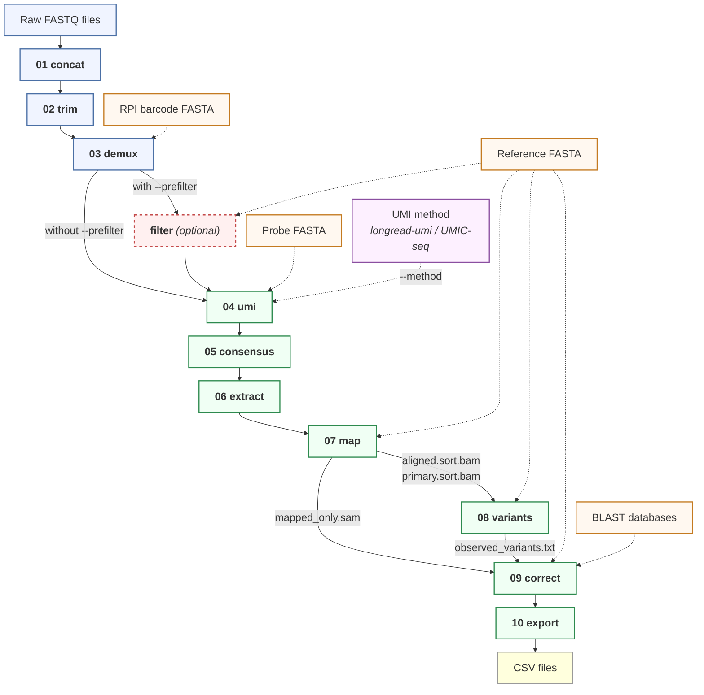

**README** | [Advanced](docs/advanced.md) | [Requirements](docs/requirements.md) | [Code Overview](docs/code-overview.md) | [Development](docs/development.md)

---

# L3Rseq

**L3R-seq** (Long-read 3' RACE-seq) is a targeted long-read sequencing method for deep quantitative analysis of RNA processing. L3Rseq is the bioinformatics pipeline that takes raw Oxford Nanopore reads and produces per-molecule annotations of RNA editing, 3' end cleavage, polyadenylation, and splicing.

The method ligates a UMI-containing adapter to the 3' end of RNA, groups cDNA reads by UMI to build a consensus for each original molecule, then maps, corrects, and annotates each consensus read. Results are exported as per-molecule CSV tables and can be explored in a built-in browser-based alignment viewer.


## Quick start

### Option A: GitHub Codespaces (no installation)

1. Click **Code** > **Codespaces** > **Create codespace** on this repository
2. Wait ~10 minutes for the environment to build
3. Run:

```bash
bash tests/run_tests.sh --quick     # verify everything works (~30s)
L3Rseq viewer                       # open the viewer (check Ports tab for URL)
```

### Option B: Docker (local data)

```bash
docker pull ghcr.io/akihitomamiya-del/l3rseq:latest

docker run --rm \
    -v ~/data/fastq:/data/input:ro \
    -v ~/results:/data/output \
    ghcr.io/akihitomamiya-del/l3rseq:latest \
    L3Rseq run --input /data/input --outdir /data/output \
    --ref /data/input/reference.fa --rpi-fasta /data/input/barcodes.fa --pattern CT
```

See [Docker usage details](#docker-usage) below for interactive mode, docker compose, and data mount explanation.

### Option C: VS Code devcontainer (local)

Clone the repo, open in VS Code, and select **Reopen in Container** > **L3Rseq Pipeline** from the command palette.

## What you need

| Input | Description |
|---|---|
| Demultiplexed FASTQs | Basecalled (SUP model) and native-barcode-demultiplexed by dorado |
| Reference FASTA | Genomic (DNA) sequence of your target gene + downstream region |
| Sample barcode FASTA | One entry per RPI (sample-specific index primer, 20 nt) |

## Running the pipeline

```bash
L3Rseq run --input data/ --outdir results/ --ref ref.fa \
    --rpi-fasta barcodes.fa --pattern CT --threads 8
```

This runs all 10 steps. Output goes to `results/01_concat/` through `results/10_csv/`.

**Common options:**

```bash
--start-at 4              # skip preprocessing (steps 01-03)
--introns "847-2891"      # classify reads as spliced/unspliced
--count-pattern TC        # SLAM-seq T-to-C counting
--pattern CT,AG           # dual editing patterns
--prefilter               # rough-map pre-filter for noisy libraries
--method umic-seq --probe probe.fa   # alternative UMI method
```

Each step is also available as a standalone subcommand: `L3Rseq map --help`, `L3Rseq correct --help`, etc.

## Pipeline overview



```
01 concat     Concatenate per-barcode FASTQ files
02 trim       3-pass adapter trimming (cutadapt)
03 demux      RPI barcode demultiplexing (cutadapt)
   filter     Optional: retain only on-target reads by rough mapping
04 umi        UMI extraction and read grouping
05 consensus  Racon-based consensus calling
06 extract    Target region extraction (cutadapt)
07 map        Mapping to reference (minimap2)
08 variants   Variant calling (LoFreq)
09 correct    3' tail correction with CIGAR-walk
10 export     CSV export + quality report
```

For per-file details (inputs, outputs, tools, line counts), see the [Code Overview](docs/code-overview.md).

After the main pipeline, optional post-analysis:

```bash
L3Rseq regions --gff annotation.gff3 --output regions.tsv
L3Rseq count   --input results/ --outdir results/ --regions regions.tsv
```

## Key features

- **UMI consensus** -- groups reads by UMI, polishes each cluster into one high-accuracy sequence
- **RNA editing quantification** -- per-read editing count (C-to-U default; configurable)
- **3' tail correction** -- [CIGAR-walk algorithm](docs/advanced.md#how-cigar-walk-works) corrects mis-assigned soft-clip boundaries
- **Splicing detection** -- per-intron spliced/retained classification; automatic intron discovery
- **Gene-level counting** -- qPCR-style molecule counting with isoform discovery and housekeeping normalization
- **Built-in viewer** -- browser-based [IGV.js alignment viewer](docs/advanced.md#alignment-viewer) with SAM tag sorting/coloring
- **Noise separation** -- per-read noise count distinguishes editing from residual sequencing errors
- **Flexible entry** -- enter at any step with `--start-at` / `--stop-at`; re-runs skip completed samples

## Output

The main output is in `10_csv/`:

| File | Contents |
|---|---|
| `{barcode}_{RPI}.csv` | One row per original RNA molecule (3' end position, tail length/sequence, editing count, noise count, all variants) |
| `{barcode}_{RPI}_quality_report.txt` | Aggregate quality metrics, substitution types, splicing efficiency |
| `pipeline_summary.tsv` | Per-step read counts for QC |

## SAM tags

Step 09 annotates each read with custom SAM tags, visible in the viewer and exported to CSV:

| Tag | Description |
|---|---|
| EC | Primary editing count (e.g., C-to-U) |
| SC | Secondary count (e.g., T-to-C for SLAM-seq) |
| NC | Noise count (non-biological substitutions) |
| VR | All detected variants (semicolon-separated) |
| 3E | 3' end position on reference |
| RC | Remaining right-clip length after correction |
| RS | Remaining right-clip sequence (e.g., poly(A) tail) |
| TL | Translocation flag (0 = normal, 1 = BLAST hit) |
| SJ | Splice junction pattern (S/R/- per intron) |

## Docker usage

### Interactive mode

```bash
docker run --rm -it \
    -v ~/data/fastq:/data/input:ro \
    -v ~/results:/data/output \
    ghcr.io/akihitomamiya-del/l3rseq:latest bash

# Inside the container:
L3Rseq run --input /data/input --outdir /data/output --ref /data/input/ref.fa --pattern CT
L3Rseq viewer --dir /data/output    # access via http://localhost:8080
```

### docker compose

```bash
cp .env.example .env   # edit with your paths and UID/GID
docker compose run l3rseq L3Rseq run \
    --input /data/input --outdir /data/output --ref /data/input/ref.fa --pattern CT
```

### Wrapper script

```bash
./l3rseq-docker --input ~/data/fastq --outdir ~/results --ref ~/data/ref.fa --pattern CT
```

### Data mounts

| Container path | Your path | Access | Contents |
|---|---|---|---|
| `/data/input` | Your FASTQ directory | Read-only | Raw reads, reference, barcodes |
| `/data/output` | Your results directory | Read-write | Pipeline output |

On Linux, add `--user "$(id -u):$(id -g)"` so output files are owned by your host user. macOS/WSL2 handles this automatically.

## Documentation

| Page | Contents |
|---|---|
| [Advanced usage](docs/advanced.md) | Adapting to your experiment, viewer guide, CIGAR-walk, splicing, gene counting |
| [Requirements](docs/requirements.md) | Platform support, conda environments |
| [Code overview](docs/code-overview.md) | Architecture, data flow, per-file summaries |
| [Development](docs/development.md) | Viewer development, testing, known issues, Docker builds |

## License

GPL-3.0 (required by UMIC-seq and longread_umi dependencies). See [LICENSE](LICENSE).

## Citation

> Mamiya A, Takenaka M, Sugiyama M. L3R-seq: A long-read 3'RACE approach for deep quantitative analysis of RNA processing. In: *Methods in Molecular Biology*. Springer. (in press)

## Acknowledgments

L3Rseq builds on two open-source projects (both GPL-3.0):

**longread_umi** ([GitHub](https://github.com/SorenKarst/longread_umi)) -- Karst SM et al. (2021). *Nature Methods*, 18, 165-169. [doi:10.1038/s41592-020-01041-y](https://doi.org/10.1038/s41592-020-01041-y)

**UMIC-seq** ([GitHub](https://github.com/fhlab/UMIC-seq)) -- Zurek PJ et al. (2020). *Nature Communications*, 11, 6023. [doi:10.1038/s41467-020-19687-9](https://doi.org/10.1038/s41467-020-19687-9)

Modifications documented in [longread_umi_L3Rseq/ATTRIBUTION.md](longread_umi_L3Rseq/ATTRIBUTION.md) and [UMIC-seq_L3Rseq/ATTRIBUTION.md](UMIC-seq_L3Rseq/ATTRIBUTION.md).
